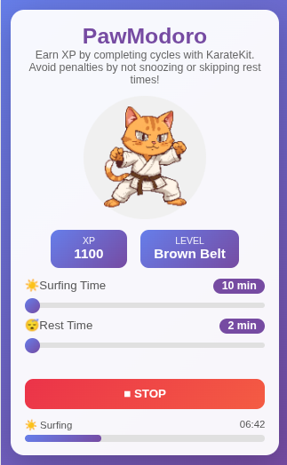
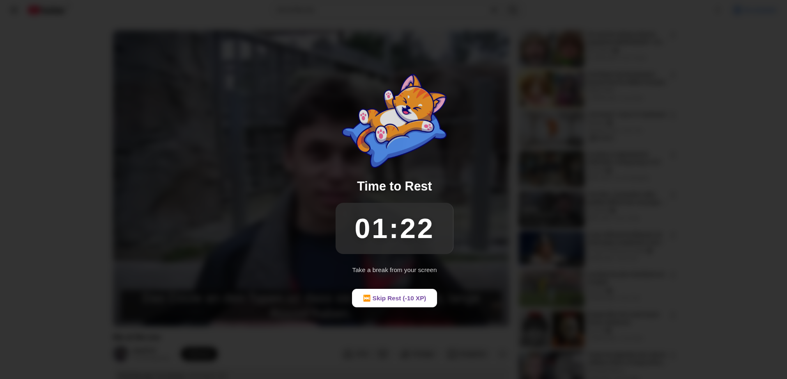

# PawModoro

A Manifest V3 compliant Google Chrome extension dedicated to protecting your eye health by encouraging regular screen breaks — featuring KarateKit, your motivational karate cat companion!


## Warning: In case of issues while testing the extension, a hotfix and videos are available in the dev branch. Please note that this hotfix has been done AFTER the submission deadline.

## The Problem

Prolonged screen exposure is a growing health concern all around the world. Studies show that staring at screens for extended periods can lead to:
- **Digital eye strain** (dry eyes, blurred vision, headaches)
- **Disrupted sleep patterns** due to blue light exposure
- **Poor posture** and associated musculoskeletal issues
- **Reduced productivity** from mental fatigue

While traditional Pomodoro timers focus on making you *work*, **PawModoro** flips the concept: it reminds you to *stop* looking at screens and take breaks to protect your health.

## Our Solution

PawModoro is a fun, gamified browser extension that:
- Lets you browse freely during **Surfing Time**
- Blocks your screen during **Rest Time** with a calming overlay
- Features **KarateKit**, a karate cat that levels up as you complete rest cycles (*Kit* meaning cat in Ukrainian language)
- Uses an **XP and belt progression system** to keep you motivated
- Applies small XP penalties for snoozing (2 XP) or skipping breaks (10 XP) (because your health matters!)

## Features

- **Customizable timers**: Set your own surfing (10-60 min) and rest (2-30 min) durations
- **Countdown warning**: A 10-second heads-up before rest time begins
- **Full-screen rest overlay**: Blocks content and pauses media to ensure you actually rest
- **Progress tracking**: Visual progress bar in the popup showing time remaining in each phase
- **Belt progression**: Earn XP and watch KarateKit advance through 7 karate belts (White to Black)
- **Privacy-first**: No data collection, no external servers, everything stays local

## Screenshots

| Popup | Sleep Screen |
|:-----:|:------------:|
|  |  |

## Installation

### From source (Developer mode)

1. Clone this repository:
   ```bash
   git clone https://github.com/iWennDev/PawModoro.git
   ```

2. Open Chrome and navigate to `chrome://extensions/`

3. Enable **Developer mode** (toggle in top-right corner)

4. Click **Load unpacked** and select the `PawModoro` folder

5. The extension icon should appear in your toolbar — you're ready to go!

## Permissions

PawModoro requests minimal permissions to function:

| Permission | Why it's needed |
|------------|-----------------|
| `storage` | Save your XP, belt level, and timer preferences locally |
| `alarms` | Schedule phase transitions (surfing ↔ rest) |
| `scripting` | Inject the rest overlay into tabs |
| `tabs` | Detect active tabs to apply the overlay |
| `host_permissions` | Access page content to display overlay and pause media |

**Privacy note**: All data is stored locally using Chrome's storage API. No information is ever sent to external servers.

## How It Works

1. **Set your timers**: Choose how long you want to surf and how long you want to rest
2. **Start the cycle**: Click the Start button to begin
3. **Surf freely**: Browse normally during Surfing Time
4. **Rest reminder**: A countdown appears 10 seconds before Rest Time
5. **Take a break**: The screen dims with a relaxing overlay — step away, stretch, rest your eyes!
6. **Earn XP**: Complete rest cycles to earn XP and level up KarateKit's belt
7. **Avoid penalties**: Snoozing (-2 XP) or skipping (-10 XP) reduces your progress

## Belt Progression

The belt system is based on the traditional karate belt hierarchy. As you accumulate XP by completing rest cycles, KarateKit will advance through the following belts:

| Belt | XP Required |
|------|-------------|
| ⬜ White Belt | 0 |
| 🟨 Yellow Belt | 30 |
| 🟧 Orange Belt | 100 |
| 🟩 Green Belt | 250 |
| 🟦 Blue Belt | 500 |
| 🟫 Brown Belt | 1000 |
| ⬛ Black Belt | 2000 |

## Nuit de l'Info 2025

This extension was created for **NEVERHACK's challenge** during the **Nuit de l'Info 2025** event. The challenge was to build a useful, innovative Chrome extension following Manifest V3 standards that solves a real browsing problem while respecting user privacy.

## License

This project is licensed under the MIT License — see the [LICENSE](LICENSE) file for details.

## Attribution

- Cat laying on a pillow icon by [Freepik](https://www.freepik.com/free-vector/cute-cat-playing-pillow-cartoon-icon-illustration_13149206.htm)
- KarateKit illustrations and icon were generated using [Canva's AI Image Generator](https://www.canva.com/features/ai-image-generator/)
- The first draft of this README was assisted by Claude Opus 4.5

---

**Take care of your eyes, level up KarateKit, and remember: your health comes first!**